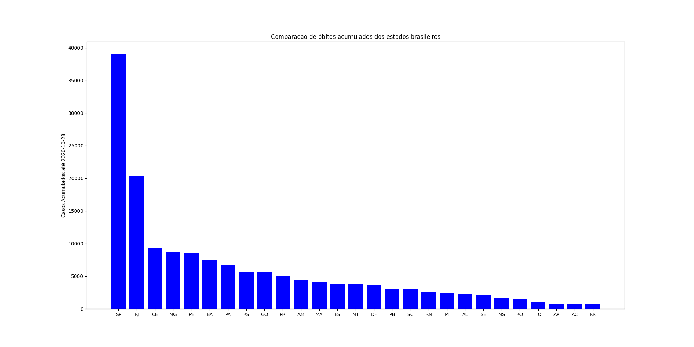

# Brasil's Covid19 Ranker

# Installing

## Ubuntu 20.04
1. instalar o python 3
2. instalar o virtualenv e iniciar ambiente virtual
```
sudo apt install virtualenv

virtualenv -p python3 .env

source .env/bin/activate
```
3. instalar dependencias do python
```
pip install -r requirements.txt
```

## Samples


